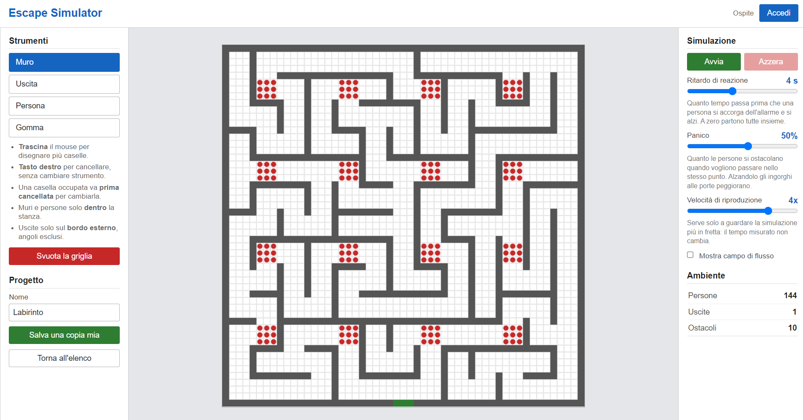
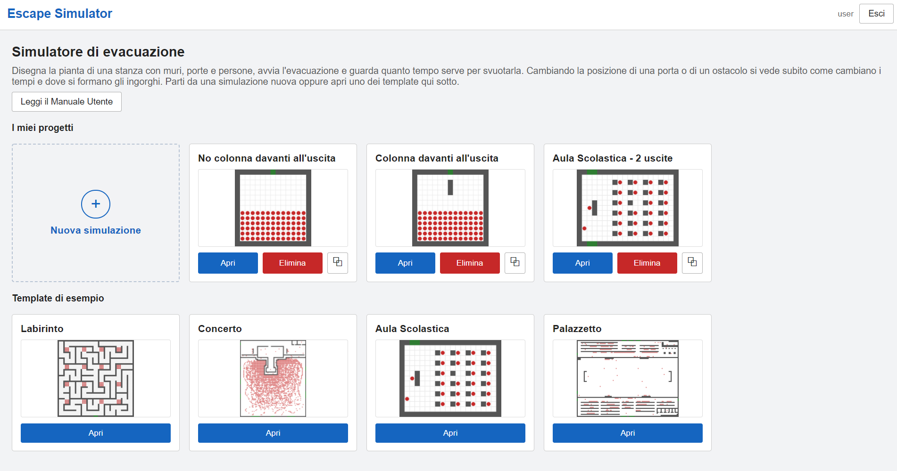

# Escape Simulator

Simulatore di evacuazione pedonale basato su automa cellulare, sviluppato in HTML, CSS, JavaScript (vanilla), PHP e SQL come progetto per l'esame di Progettazione Web - Ingegneria Informatica Pisa.

L'utente costruisce la pianta di un ambiente in un editor, avvia la simulazione e osserva come le persone raggiungono le uscite, con la possibilità di mettere in pausa, riprendere e ripetere. Al termine viene mostrato un report dell'evacuazione. I progetti vengono salvati nel database e possono essere duplicati per confrontare varianti dello stesso ambiente.

## Il modello

Ogni persona occupa una cella della griglia e a ogni passo si muove verso l'uscita seguendo un campo di distanza, con movimento in 8 direzioni (le diagonali pesano 1.414 nel calcolo della distanza), secondo l'impostazione di Burstedde et al. (2001).

Quando più persone puntano alla stessa cella, il conflitto viene risolto con un parametro di attrito μ = 0.70 (Kirchner et al., 2003). Il parametro chiamato "panico" nell'interfaccia corrisponde a quello che in letteratura è descritto come comportamento competitivo.

La velocità in ingresso è la velocità di camminata libera misurata da Weidmann (1993), in media 1.34 m/s. I rallentamenti dovuti alla congestione non sono imposti dall'esterno ma emergono dal modello.

## Limitazioni note

Poiché un passo in diagonale copre una distanza maggiore di un passo ortogonale nello stesso tempo, chi si muove in diagonale risulta circa il 41% più veloce. È un artefatto noto di questa classe di modelli (Burstedde et al., 2001) ed è stato mantenuto come semplificazione.

Il simulatore è uno strumento didattico e non è validato per la progettazione di vie di fuga reali.

## Screenshot

## Requisiti e installazione

Ambiente di riferimento: XAMPP 8.0.10 (Apache 2.4.48, PHP 8.0.10, MariaDB 10.4.21). Il progetto è stato testato solo su Windows, con il pacchetto fornito dal corso.

1. Copiare la cartella del progetto nella `htdocs` di XAMPP.
2. Importare il file `escape_simulator.sql`, che crea il database e le tabelle (ad esempio dalla scheda "Importa" di phpMyAdmin, senza selezionare prima un database).
3. Aprire `http://localhost/escape-simulator/`.

L'applicazione usa le credenziali predefinite di XAMPP: utente `root`, nessuna password.